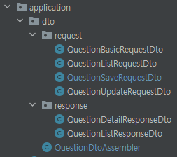
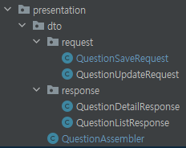

## 중첩 클래스로 DTO 관리하기

최근 프로젝트 리팩토링을 진행하면서 DTO 클래스가 많아 관리에 어려움을 겪었다.  

### 문제 상황
- 엔터티 속성 중 일부를 나타내는 VO 클래스에 새로운 속성이 추가됨
- 해당 VO와 적절하게 대응될 수 있도록 DTO 클래스의 변경이 요구되었으나 많고 분산되어 있는 상태, 가독성이 떨어지고 관리가 어려운 문제 발생
  - 관련된 DTO assembler 클래스에도 영향을 끼침
  
  

  
  
  
위 목록만 봐서는 어떤 클래스에 변경이 필요한지 알아차리기 어려웠고, 엔터티의 작은 변경 하나에도 많은 DTO의 변경이 요구되는 것은 분명히 개선해야할 점이라고 느꼈다.  
물론 당시 Assembler를 통해 결합도를 줄이려는 노력이 있었지만, 그럼에도 의존성을 제대로 분리해주지 못한 점이 있다. 게다가, 개발이 진행됨에 따라 DTO도 점점 늘어날 것이 뻔했다.  
따라서, DTO를 단순하게 수정, 관리할 새로운 방법이 필요했다. 이러한 문제를 나만 경험하진 않았을 것 같아 리서치 해본 결과 중첩 클래스를 활용한 사례를 찾아냈다.  
  


특히 VO 클래스 @Embeddable를 붙여 엔터티 속성 일부를 나타낼 때, 
`질문` 엔터티에 필드를 새롭게 추가해야하는 상황이 생겼다.   
기존에는 질문의 내용을 `questionContents` 필드 하나로 표현했다면, `questionGeneral`, `questionError`, `questionCode` 로 좀 더 세분화해서 관리하려는 의도였다.  
해당 필드는 VO 클래스를 통해 Embed 되어있는 상태였는데,   

```java
@Embeddable
public class QuestionContents {

    public static final int MAXIMUM_CONTENT_LENGTH = 100000;

    @Column(name = "qs_contents", columnDefinition = "text", nullable = false)
    private String queContents;

    protected QuestionContents() {
    }

    public QuestionContents(String queContents) {
        validateNullContents(queContents);
        validateEmptyContents(queContents);
        validateMaximumLength(queContents);
        this.queContents = queContents;
    }
    
    // 생략
}

```
