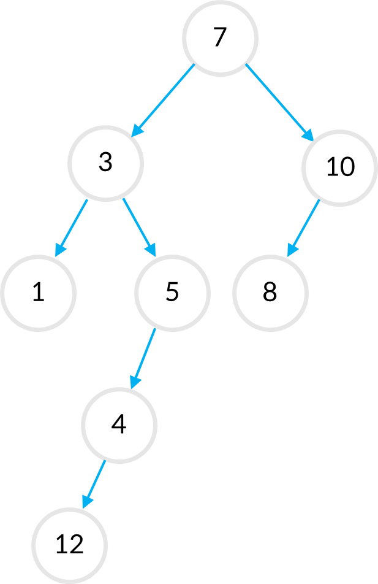

## ✅ 오늘의 문제: 트리의 높이 구하기

오늘은 트리를 순회하는 방법에 대해 알아봤어요.

 
근데, 트리를 단순히 순회하기 보단 무언가 목적을 갖고

순회하는 편이 동기부여도 되고, 좋지 않을까요?😉

 
아래 예시로 주어진 트리를 구성하고, 트리를 순회하는 함수를 만들어 주세요!

 
함수에서는 트리 순회후, 트리에서 가장 깊은 레벨에 존재하는 노드와,

그 때의 트리의 높이를 출력해야 합니다 😉

